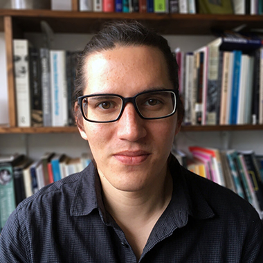

<link rel="stylesheet" href="styles.css" type="text/css">

 

##### About Me

I work as an Associate Professor in the School of Psychology, University of Plymouth, UK. My main research interests are in human memory and understanding the relation between explicit (conscious) and implicit (unconscious) forms of memory. I use behavioural experimentation and computational modelling approaches to test different theories.

 

##### Background
Associate Professor, University of Plymouth

Lecturer, University of Plymouth

Teaching Fellow, University College London

ESRC Research Fellow, University College London

PhD Psychology, University College London

BSc (Hons) Psychology, University College London

 

##### Professional Membership

Member of the Experimental Psychology Society (EPS)

Fellow of the Higher Education Academy (FHEA)

Member of the Psychonomic Society

 

##### Other Roles
[MSc Advanced Psychology](https://www.plymouth.ac.uk/courses/postgraduate/msc-advanced-psychology) Programme Lead

[MPsych Advanced Psychology](https://www.plymouth.ac.uk/courses/undergraduate/mpsych-advanced-psychology) Programme Lead

[Research Apprenticeship Scheme](https://www.psy.plymouth.ac.uk/admin4/apprenticeships/) Coordinator

 